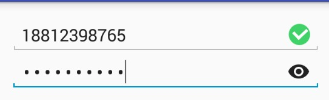

# 介绍
这是一个每次登录注册时候经常遇到的两个插件

一个是是否可以看密码
另外一个是删除输入的内容

# 支持设置有效长度
如果长度等于有效长度，（eg：电话号码长度11位）。显示勾勾,否则显示感叹号

# 使用方法

	<com.xk.sanjay.PasswordEditText
        android:layout_width="match_parent"
        android:layout_height="wrap_content"
        app:drawable_hide="@mipmap/ic_visibility"
        app:drawable_show="@mipmap/ic_visibility_off" />

    <com.xk.sanjay.ClearEditText
        android:layout_width="match_parent"
        android:layout_height="wrap_content"
        android:drawableRight="@drawable/selector_delete" />

#小问题

想到还有一个问题就是没加下横线。下次有空加上去

# 鸣谢
这个密码的空间是基于[showhidepasswordedittext](https://github.com/scottyab/showhidepasswordedittext)控件修改的

[Android-EditText(自定义带删除功能的EditText)](http://blog.csdn.net/xiaoganstar/article/details/43053991)

# Licence

	Copyright (c) 2015 Scott Alexander-Bown
	
	Licensed under the Apache License, Version 2.0 (the "License");
	you may not use this file except in compliance with the License.
	You may obtain a copy of the License at
	
	http://www.apache.org/licenses/LICENSE-2.0
	
	Unless required by applicable law or agreed to in writing, software
	distributed under the License is distributed on an "AS IS" BASIS,
	WITHOUT WARRANTIES OR CONDITIONS OF ANY KIND, either express or implied.
	See the License for the specific language governing permissions and
	limitations under the License.
 
