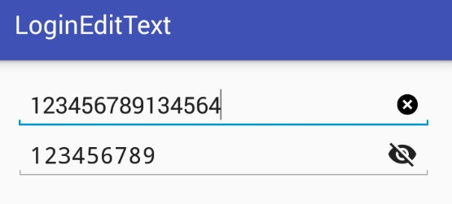

# 介绍
这是一个每次登录注册时候经常遇到的两个插件

一个是是否可以看密码
另外一个是删除输入的内容

# 使用方法

	<com.xk.sanjay.PasswordEditText
        android:layout_width="match_parent"
        android:layout_height="wrap_content"
        app:drawable_hide="@mipmap/ic_visibility"
        app:drawable_show="@mipmap/ic_visibility_off" />

    <com.xk.sanjay.ClearEditText
        android:layout_width="match_parent"
        android:layout_height="wrap_content"
        android:drawableRight="@drawable/selector_delete" />